# Daybreak

A personal Android app for the start of your day: the weather for where you are and the places you save (in both °F and °C), holidays and your own dates, and a few fun things, with an optional on-device Gemma model writing the daily meme. (It began as a weather app; the tabs Home · Weather · Clocks · Settings are on the way, see [docs/design/shell.md](docs/design/shell.md).)

> **Coming from the old "Weather" app?** Daybreak has a new application id (`app.daybreak`), so it installs as a separate app and starts empty: add your places again, import or download the Gemma model again, and re-add your dates. Then uninstall the old Weather app (its widget and background refresh go with it).

- Tonight's sky (on Home): the moon drawn as it is tonight with its phase and how much is lit, the next full moon by its old name (the Harvest Moon, the Hunter's Moon…), the next meteor shower when one peaks within two weeks (and whether a bright moon will wash it out), and whether the forecast says it's clear enough to look up. All worked out on the phone. Turn it off in Settings → Fun
- Clocks: the places you call or work with, each with its time, whether it's today or tomorrow there, how far ahead or behind you it is and its UTC offset, following daylight saving. A converter shows one moment in every clock ("At 12:00 PM today in Los Angeles it's 10:00 PM in Bucharest"). Places come from the same search as Weather, which gives each one's time zone
- Search for any city and save it; swipe between places, reorder or remove them
- Current location is optional: turn it off and use saved places only
- A one-line summary at the top, a large temperature in your preferred unit with the other unit alongside, today's high/low and rain (chance and, when there's enough to mention, the day's total: "Rain 60% · 4 mm"), and the next 12 hours with each hour's chance and amount, and how warm or cold it feels once any hour is 3° or more away from the thermometer ("feels 54°")
- Today's sunrise, sunset, UV index, wind with its direction ("↗ from the SW") and gusts, plus a 10-day list with each day's range on a shared scale and its rain or snow total ("4 mm", "3 cm snow"); the last three days are drawn lighter as less certain, with their date
- Tap any day for its details: the day's condition, high and low in both units and feels-like range; the temperature hour by hour; a rain (or snow) card with a verdict ("Rain likely · about 12 mm over 6 hours"), when it falls ("Mostly in the afternoon, heaviest around 4 PM."), a bar per hour with the chance under it, and the parts of the day (before sunrise, daytime, evening) that add up to the verdict, plus a line when it carries on after midnight; the day's wind, gusts and direction; sunrise, sunset and UV
- One set of rules for rain everywhere ([`Precip.kt`](app/src/main/java/app/daybreak/domain/Precip.kt)): hourly chances from 10% (blue from 40%), daily chances from 20%, hourly amounts from 0.1 mm and day totals from 0.5 mm, an amount only with a 20% chance or from 1 mm ("A small chance of rain · up to 2 mm"); "likely" from 70%, "possible" from 40%. One classifier (dry, possible or likely) judges every day, part of a day and hour from its chance and amount together. Amounts are in mm (snow in cm) with °C and inches with °F, never both
- "Updated 8 min ago" on each Weather page, from when the app fetched it; past 90 minutes it turns amber and suggests pulling to refresh. A refresh that fails keeps the forecast and says so: "Couldn't refresh · updated 2 hours ago"
- Temperatures in both units: the primary one large, the other small alongside or underneath (current, feels-like, hourly strip, 10-day list and day details); screen readers hear both
- "Best time to ride" (or run, or walk): each of the next 24 hours is scored for rain, wind and gusts, temperature and daylight, and the page shows the best window with a bar per hour, or what's in the way
- Tap a tile (Feels like, Humidity, Wind, UV index, Sunrise/Sunset), the Rain pill or a day's rain card for a plain-language explanation of the term and of the value ("Colder than the air: the 19 mph wind carries heat away from your skin")
- A home-screen widget (4×2 by default, resizable down to 2×1) with the first page's place, the temperature in both units, today's high, low and rain chance, and the summary line on the same sky colour as the app; smaller sizes keep the icon and temperature and drop the rest. It mirrors the app whenever you open it and refreshes the numbers and summary every couple of hours in the background. Location isn't read there: the widget keeps the place the app last showed. Its cache (with that location) is excluded from backup
- "Coming up": the next public holiday and long weekend in each place's country (including when a day of leave makes a 4-day weekend), the next season, and that day's forecast when it's within the 10-day forecast. Holidays come from [Nager.Date](https://date.nager.at) (free, no key; it sees your IP address and each place's country, and nothing else) and are cached for a month. Only nationwide holidays are shown, so countries whose holidays are mostly regional (the UK, for example) show fewer. Add your own dates there too (a birthday that comes round every year, a big presentation, a week off): the next few count down on the first page alongside the holidays, and a day off says what kind of break it makes ("Makes a 4-day weekend"). They stay on the phone and aren't backed up. Turn it all off in Settings → Coming up
- A daily weather meme per place, made entirely on the phone (no network): a hand-written caption for the day's mood, or a fresh one from Gemma once it's set up. Turn it off in Settings
- Optional on-device [Gemma](https://ai.google.dev/gemma) model for the meme's caption, run locally with [MediaPipe LLM Inference](https://ai.google.dev/edge/mediapipe/solutions/genai/llm_inference). No data leaves the phone
- Weather and place search from [Open-Meteo](https://open-meteo.com/) (free, no API key). The app fetches 10 days of hourly and daily data per place in one request, including feels-like, rain and snow amounts, hours of rain, wind with its direction, gusts, sun times and UV
- Uses Android's built-in location service (no Google Play Services required)
- Kotlin + Jetpack Compose, min Android 8.0 (API 26)

## Screenshots

The backdrop follows the conditions and the time of day at each place (clear, cloudy, rain, snow, storm; day or night, from each place's real sunrise and sunset), and the app has its own light and dark palettes.

| Weather | Dark | Home | Rainy night |
|:---:|:---:|:---:|:---:|
| 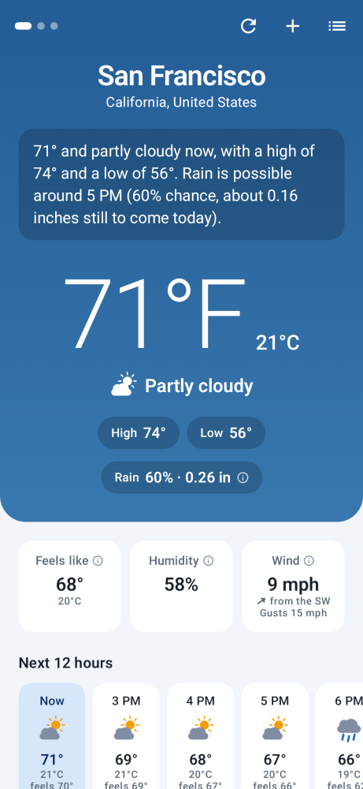 | 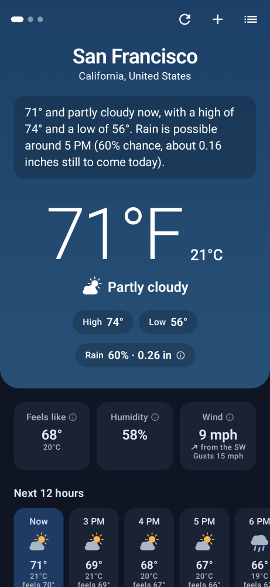 | 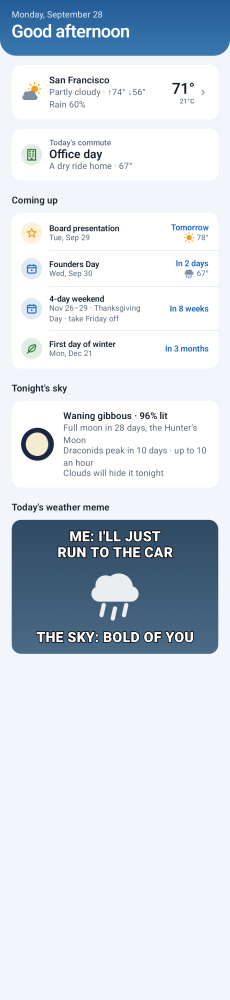 |  |

| First run | Loading | Permission | Error |
|:---:|:---:|:---:|:---:|
| 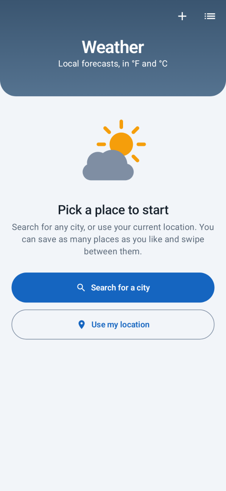 | 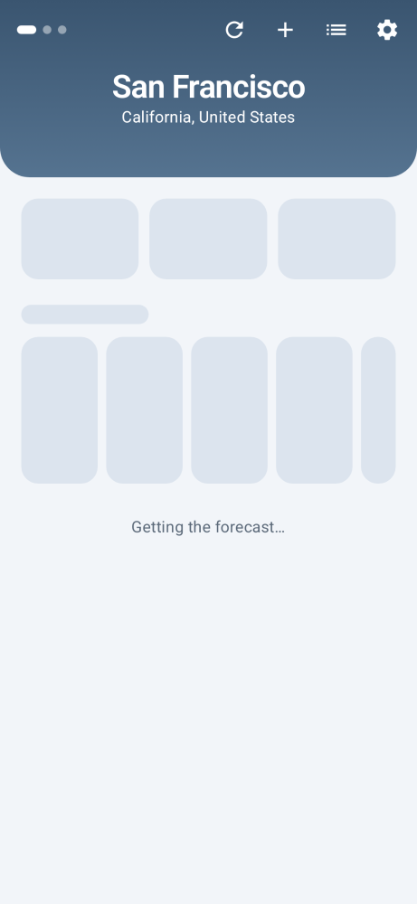 | 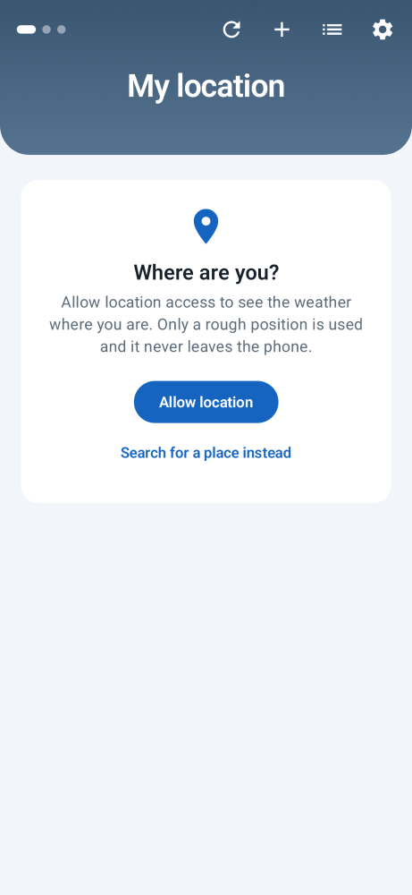 | 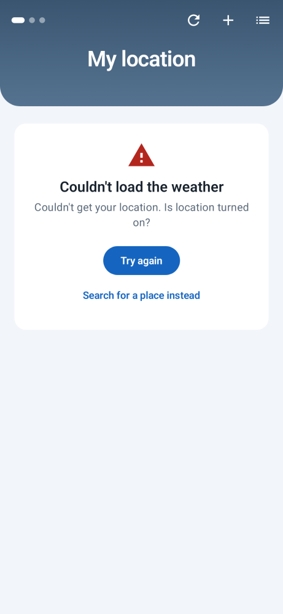 |

| Search | Places | Settings: set up Gemma | Settings: downloading |
|:---:|:---:|:---:|:---:|
| 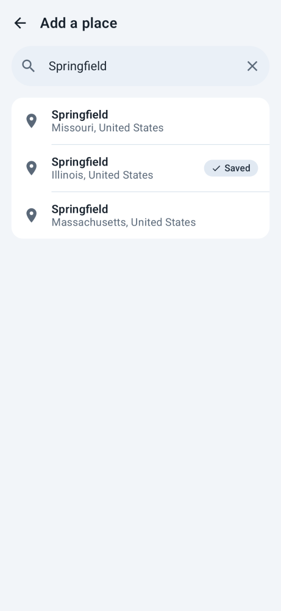 | 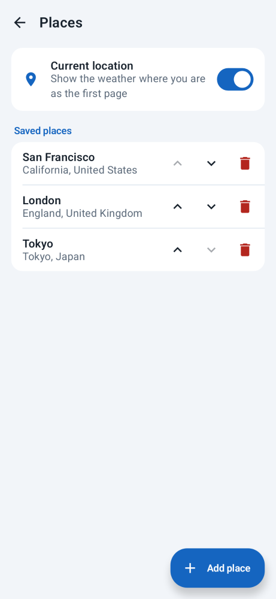 | 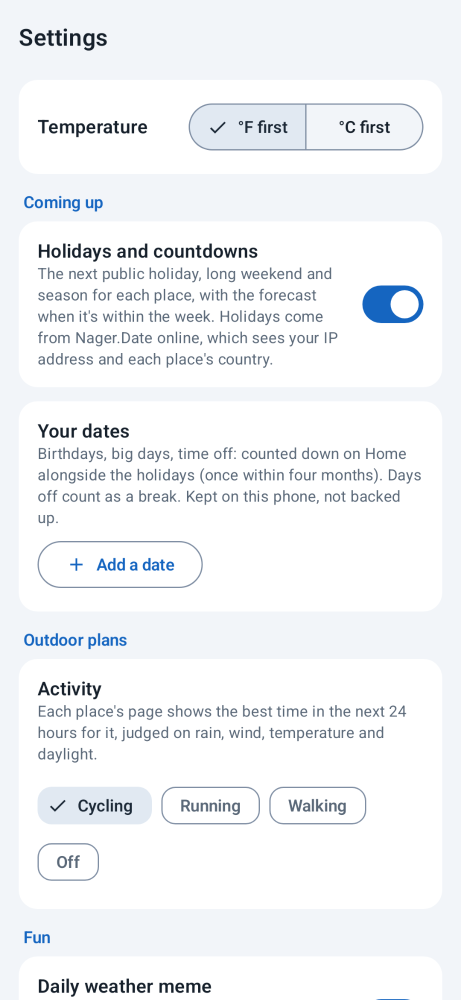 |  |

| Full page | Full page (dark, °C) | Rain and snow amounts | Weather memes |
|:---:|:---:|:---:|:---:|
| 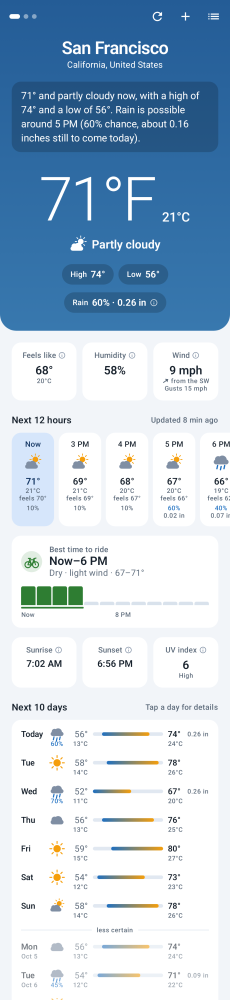 | 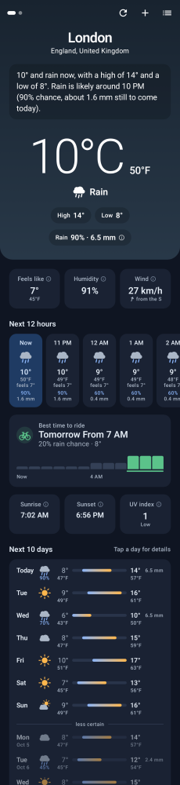 | 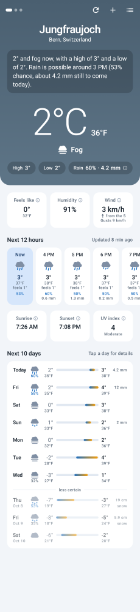 | 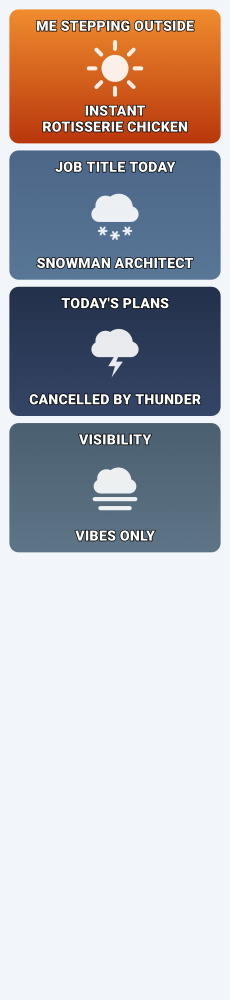 |

| Day: showers | Day: snow (°F) | Day: dry | Day (dark) |
|:---:|:---:|:---:|:---:|
| 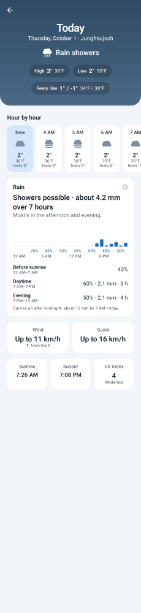 | 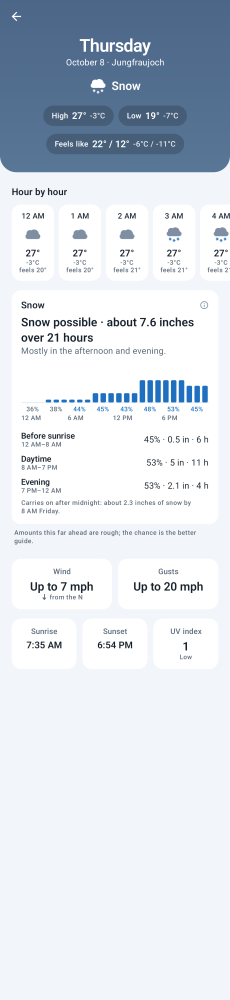 | 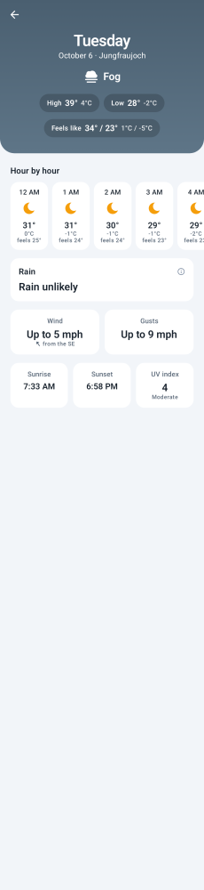 | 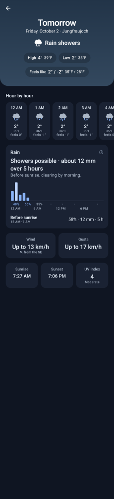 |

| Settings: installed | Settings: failed (dark) | Rainy night (dark) | App icon |
|:---:|:---:|:---:|:---:|
|  | 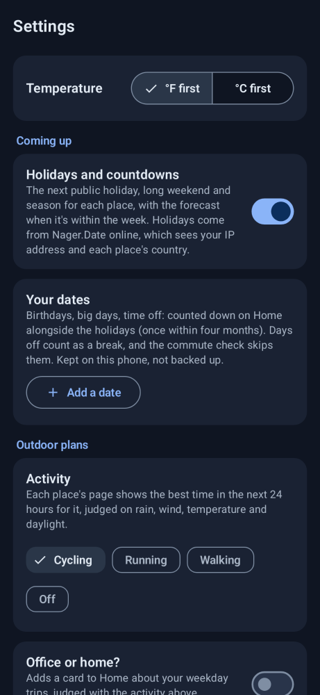 | 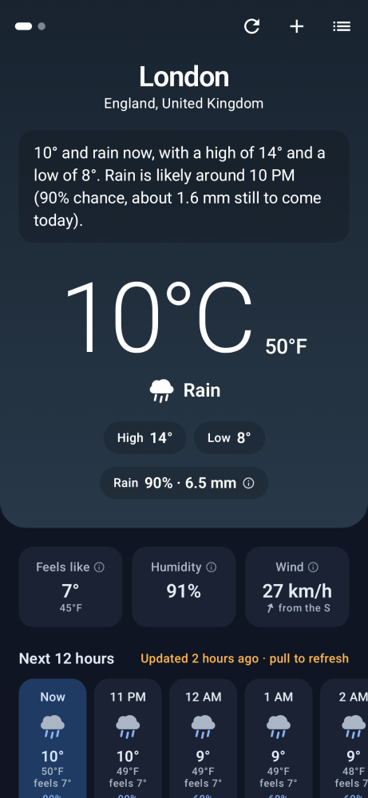 |  |

These are rendered from the app's real UI code with sample data using [Paparazzi](https://github.com/cashapp/paparazzi). Weather icons and the launcher icon are drawn in code and as vector drawables, so there are no bitmap assets. To regenerate the screenshots after UI changes:

```
./gradlew recordPaparazziDebug
```

`./gradlew verifyPaparazziDebug` fails if the UI no longer matches them.

## On-device Gemma meme

The summary line at the top of each page is a built-in template ("71° and partly cloudy now, with a high of 74°…"). Gemma doesn't write it; it writes the caption of the daily weather meme on Home. Without Gemma, a hand-written caption is used.

To set it up, go to **Settings → Gemma** and follow the three steps on screen:

1. Open the model page, [litert-community/Gemma3-1B-IT](https://huggingface.co/litert-community/Gemma3-1B-IT), and accept the Gemma license (free Hugging Face account).
2. Create a Hugging Face access token with read permission and paste it into the app. The token is only used once, to start the download; it isn't stored.
3. Download the model (about 550 MB, Wi-Fi recommended). The download runs through the system download manager, so it carries on in the background (and resumes being tracked if the app is closed), and the file is checked against the SHA-256 checksum Hugging Face reports (or its expected size, if no checksum is given) before being installed.

If you already have `gemma3-1b-it-int4.task` on the phone, **Import file…** copies it into the app's own storage instead, so you can delete the original afterwards.

How it works:

- The model runs on the CPU through MediaPipe LLM Inference (`com.google.mediapipe:tasks-genai`), with a 30-second timeout. It's loaded on first use and released after a few idle minutes.
- The prompt ([`Meme.kt`](app/src/main/java/app/daybreak/narration/Meme.kt)) describes the day in words only, and is sampled with a playful temperature and a per-day seed. [`MemeValidator`](app/src/main/java/app/daybreak/narration/Meme.kt) accepts only a two-line `TOP:`/`BOTTOM:` caption with no digits, emoji or rude words; the meme is marked "Written by Gemma on this device".
- Gemma gets one try per place, day and mood; the result, or the hand-written caption if it's rejected or the model is missing, slow or errors out, is cached (`MemeRepository`) so the meme stays the same all day. Gemma's memes need both **Daily weather meme** and **Use Gemma for the meme** switched on.
- Expect a few seconds per caption on recent phones and longer on older ones. MediaPipe's native library makes the APK bigger, so it's built only for 64-bit ARM (phones) and x86_64 (emulators). It needs a 64-bit device.

## Code layout

```
app/src/main/java/app/daybreak/
  domain/     Place, Forecast, AppSettings; unit conversion and formatting; WMO code descriptions;
              Precip (the one rule set for rain and snow: thresholds, the classifier, words, amounts, a day's timing and parts);
              ActivityScorer (best time to ride/run/walk); ComingUp (holidays, long weekends, seasons)
  data/       HttpClient, Open-Meteo forecast + geocoding API and JSON parsers,
              saved places, settings and daily meme repositories (SharedPreferences), device location,
              Nager.Date holiday API + HolidayRepository (cached per country and year)
  narration/  TemplateNarrator (the summary line), GemmaNarrator (MediaPipe),
              GemmaModelStore (model download + import),
              Meme (mood, template captions, prompt, validator, MemeWriter)
  ui/         WeatherViewModel (StateFlow), stateless screens (DayScreen: a day's details), WeatherApp (navigation, pickers),
              Theme (palettes, type), Sky (condition -> backdrop), WeatherIcons (Canvas-drawn glyphs),
              MemeCard
  widget/     WeatherWidget (Jetpack Glance), its receiver, WidgetRefreshWorker (WorkManager), WidgetPublisher
```

## Build and test

Requires JDK 17 and the Android SDK (`ANDROID_HOME` or `local.properties` pointing at it).

```
./gradlew testDebugUnitTest verifyPaparazziDebug assembleDebug
```

[GitHub Actions](.github/workflows/ci.yml) runs the same command on every pull request and push to `main`, and uploads the test reports and screenshot diffs if a test or screenshot check fails.

The unit tests cover JSON parsing (with real Open-Meteo responses as fixtures), formatting, the rain rules and the day page's verdict, timing and the parts of the day, the template narrator, meme caption validation, the repositories and the ViewModel (with fakes). The APK ends up in `app/build/outputs/apk/debug/`.

## License

[MIT](LICENSE)
