# WeatherApp

A simple Android app that shows the weather for your current location and any places you save, in both °F and °C.

- Search for any city and save it; swipe between places, reorder or remove them
- Current location is optional: turn it off and use saved places only
- A one-line summary at the top, a large temperature in your preferred unit with the other unit alongside, today's high/low and rain chance, and the next 12 hours
- Today's sunrise, sunset, UV index and wind gusts, plus a 7-day list with each day's range on a shared scale
- Temperatures in both units: the primary one large, the other small alongside or underneath (current, feels-like, hourly strip and 7-day list); screen readers hear both
- "Best time to ride" (or run, or walk): each of the next 24 hours is scored for rain, wind and gusts, temperature and daylight, and the page shows the best window with a bar per hour, or what's in the way
- "Office or home?": set your weekday travel times and the first page tells you whether it's an office day, an office day with a catch ("Rain possible on the way home · 35% at 5 PM", or "take lights" in winter) or a day to work from home, judged for your chosen activity. Weekends and public holidays are skipped
- Pick the summary's voice (Friendly, Brief, Cheerful, Deadpan, Pirate) and optionally tell it a little about yourself ("I cycle to work"), which Gemma uses to choose what to mention. The note never leaves the phone
- "Coming up": the next public holiday and long weekend in each place's country (including when a day of leave makes a 4-day weekend), the next season, and that day's forecast when it's within the week. Holidays come from [Nager.Date](https://date.nager.at) (free, no key; it sees your IP address and each place's country, and nothing else) and are cached for a month. Only nationwide holidays are shown, so countries whose holidays are mostly regional (the UK, for example) show fewer. Turn it off in Settings → Coming up
- A daily weather meme per place, made entirely on the phone (no network): a hand-written caption for the day's mood, or a fresh one from Gemma once it's set up. Turn it off in Settings
- Optional on-device AI summary written by [Gemma](https://ai.google.dev/gemma), run locally with [MediaPipe LLM Inference](https://ai.google.dev/edge/mediapipe/solutions/genai/llm_inference). No data leaves the phone
- Weather and place search from [Open-Meteo](https://open-meteo.com/) (free, no API key). The app fetches 8 days of hourly and daily data per place, including wind, gusts, sun times and UV
- Uses Android's built-in location service (no Google Play Services required)
- Kotlin + Jetpack Compose, min Android 8.0 (API 26)

## Screenshots

The backdrop follows the conditions and the time of day at each place (clear, cloudy, rain, snow, storm; day or night, from each place's real sunrise and sunset), and the app has its own light and dark palettes.

| Weather | Dark | Gemma summary | Rainy night |
|:---:|:---:|:---:|:---:|
| 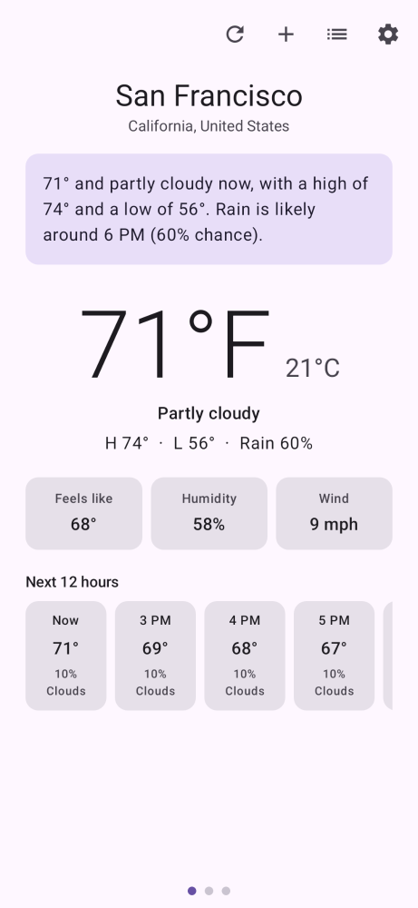 | 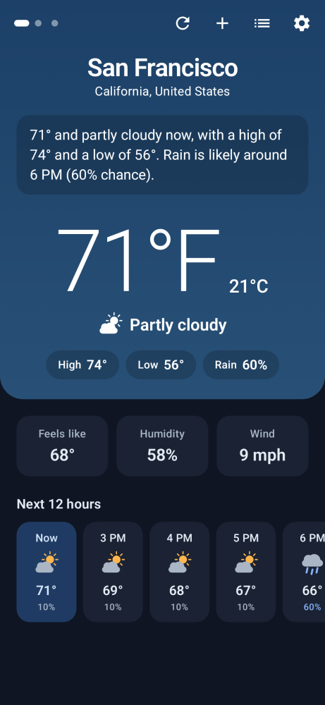 | 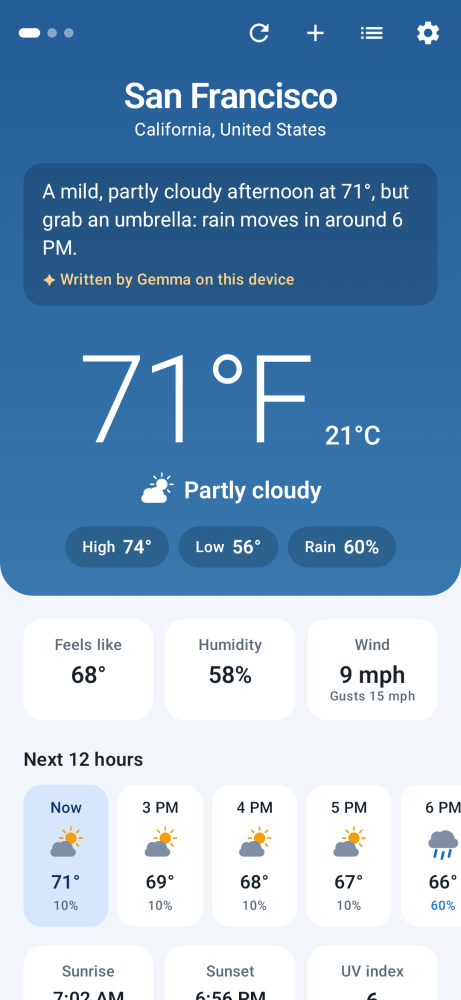 | 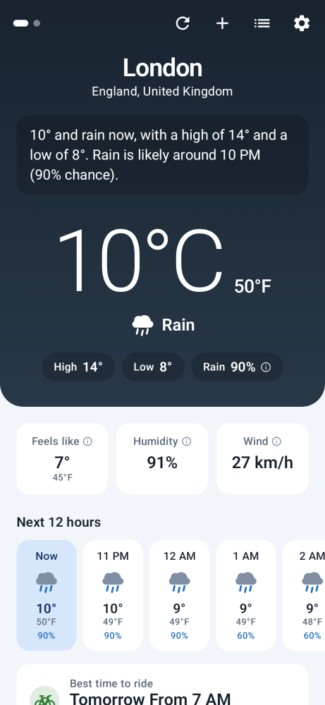 |

| First run | Loading | Permission | Error |
|:---:|:---:|:---:|:---:|
| 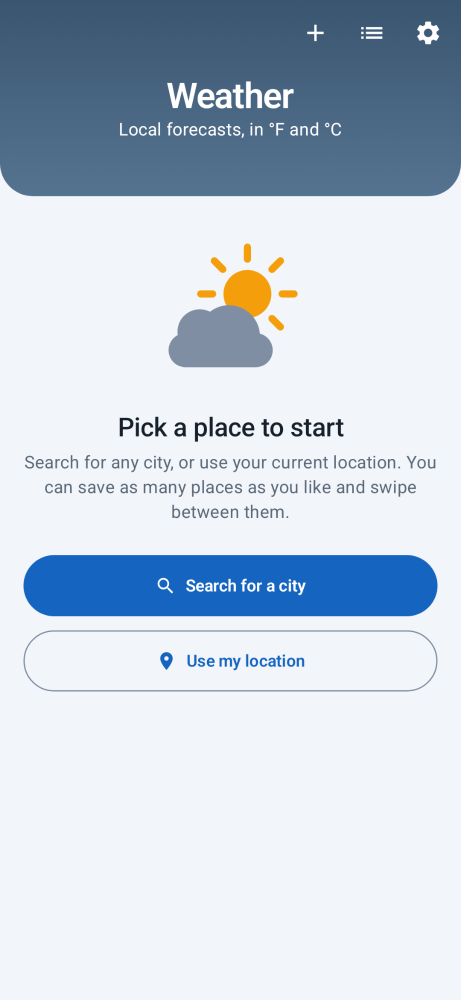 | 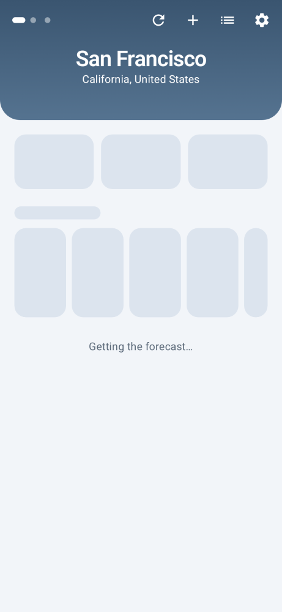 |  | 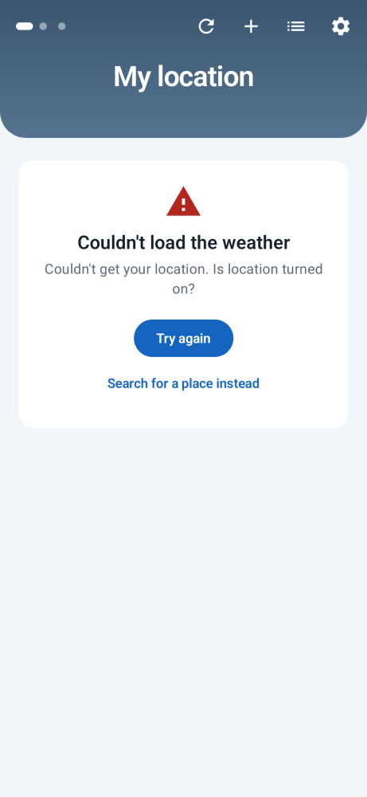 |

| Search | Places | Settings: set up Gemma | Settings: downloading |
|:---:|:---:|:---:|:---:|
|  | 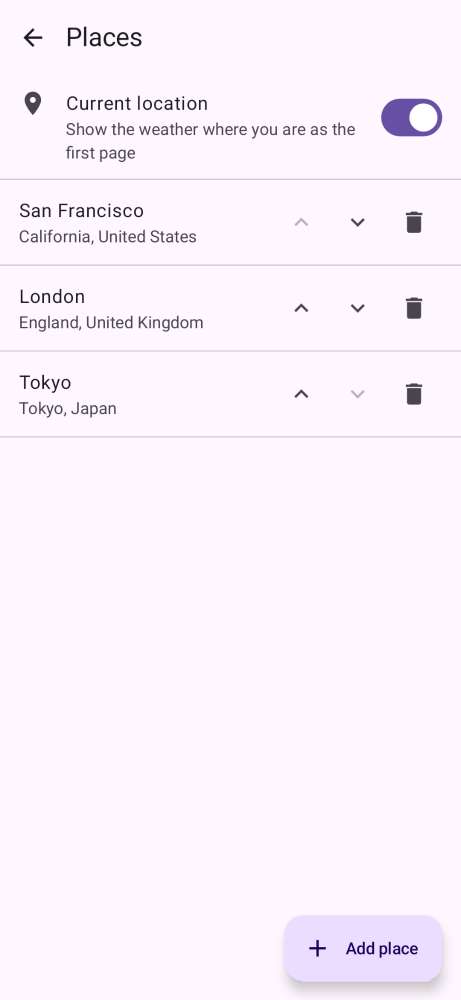 | 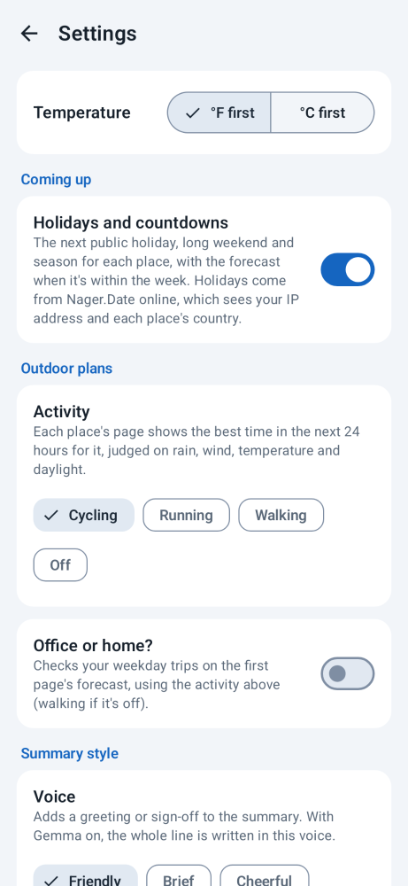 | 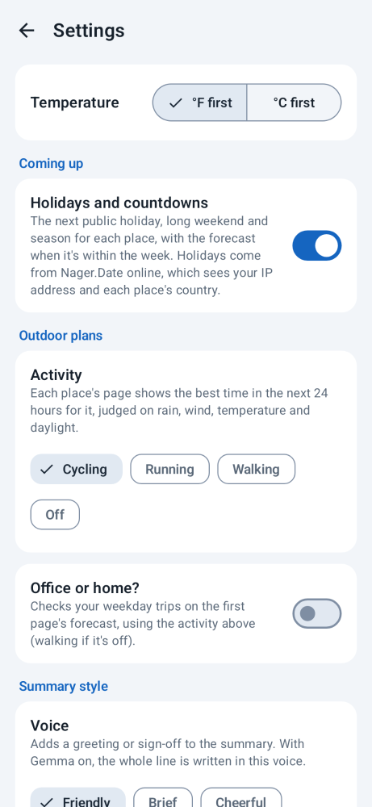 |

| Full page | Full page (dark, °C) | Weather memes |
|:---:|:---:|:---:|
| 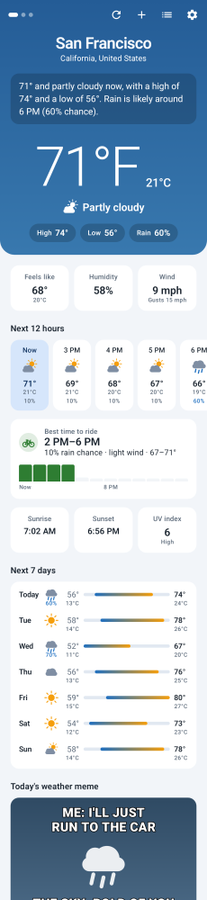 | 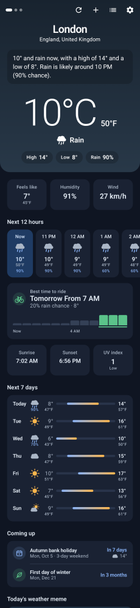 | 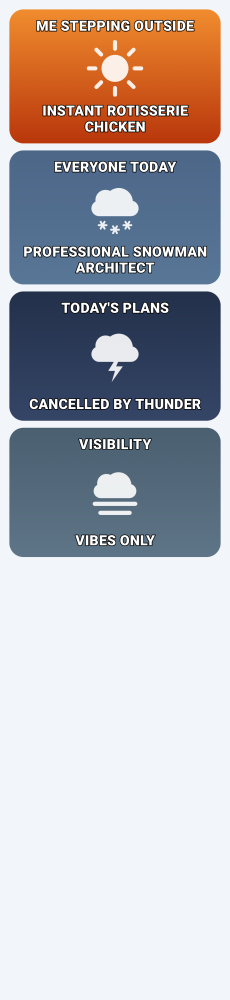 |

| Settings: installed | Settings: failed (dark) | Rainy night (dark) | App icon |
|:---:|:---:|:---:|:---:|
| 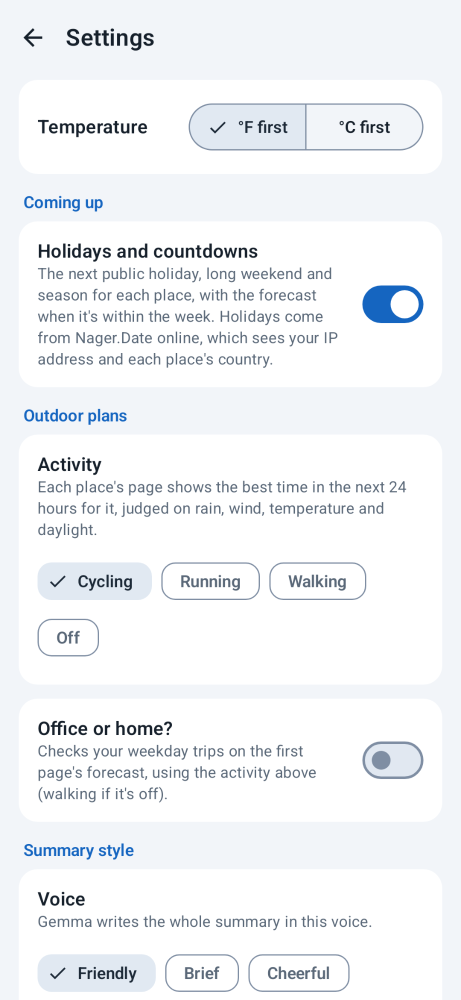 | 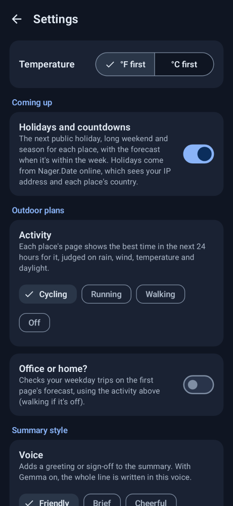 | 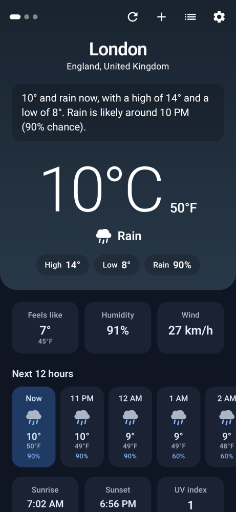 |  |

These are rendered from the app's real UI code with sample data using [Paparazzi](https://github.com/cashapp/paparazzi). Weather icons and the launcher icon are drawn in code and as vector drawables, so there are no bitmap assets. To regenerate the screenshots after UI changes:

```
./gradlew recordPaparazziDebug
```

`./gradlew verifyPaparazziDebug` fails if the UI no longer matches them.

## On-device Gemma summary

The summary line always starts as a built-in template ("71° and partly cloudy now, with a high of 74°…"). Once a Gemma model is installed, the app also asks Gemma to describe the forecast and shows its text instead, marked "Written by Gemma on this device".

To set it up, go to **Settings → AI summary** and follow the three steps on screen:

1. Open the model page, [litert-community/Gemma3-1B-IT](https://huggingface.co/litert-community/Gemma3-1B-IT), and accept the Gemma license (free Hugging Face account).
2. Create a Hugging Face access token with read permission and paste it into the app. The token is only used once, to start the download; it isn't stored.
3. Download the model (about 550 MB, Wi-Fi recommended). The download runs through the system download manager, so it carries on in the background (and resumes being tracked if the app is closed), and the file is checked against the SHA-256 checksum Hugging Face reports (or its expected size, if no checksum is given) before being installed.

If you already have `gemma3-1b-it-int4.task` on the phone, **Import file…** copies it into the app's own storage instead, so you can delete the original afterwards.

How it works:

- The model runs on the CPU through MediaPipe LLM Inference (`com.google.mediapipe:tasks-genai`), with low temperature and a 30-second timeout. It's loaded on first use and kept in memory while the app runs.
- The prompt is a short instruction plus the forecast as JSON, in your preferred unit ([`GemmaPrompt`](app/src/main/java/com/mazzucci/weather/narration/GemmaPrompt.kt)).
- Gemma's reply is checked before it's shown ([`NarrationValidator`](app/src/main/java/com/mazzucci/weather/narration/NarrationValidator.kt)). Every temperature, percentage and other number must match the forecast data, and the reply must be short plain text: at most 2 sentences (160 characters for the Brief voice), or up to 4 with a greeting and sign-off for the playful voices. If the check fails, or the model is missing, slow or errors out, the template summary stays.
- The same engine writes the daily meme ([`Meme.kt`](app/src/main/java/com/mazzucci/weather/narration/Meme.kt)), with a playful temperature and a per-day seed. Its prompt describes the day in words only, and [`MemeValidator`](app/src/main/java/com/mazzucci/weather/narration/Meme.kt) accepts only a two-line `TOP:`/`BOTTOM:` caption with no digits, emoji or rude words. Gemma gets one try per place, day and mood; the result, or the hand-written template if it's rejected, is cached (`MemeRepository`) so the meme stays the same all day. Gemma's memes need both **Daily weather meme** and **Describe the weather with Gemma** switched on.
- Expect a few seconds per summary on recent phones and longer on older ones. MediaPipe's native library makes the APK bigger, so it's built only for 64-bit ARM (phones) and x86_64 (emulators). It needs a 64-bit device.

## Code layout

```
app/src/main/java/com/mazzucci/weather/
  domain/     Place, Forecast, AppSettings; unit conversion and formatting; WMO code descriptions;
              ActivityScorer (best time to ride/run/walk); ComingUp (holidays, long weekends, seasons)
  data/       HttpClient, Open-Meteo forecast + geocoding API and JSON parsers,
              saved places, settings and daily meme repositories (SharedPreferences), device location,
              Nager.Date holiday API + HolidayRepository (cached per country and year)
  narration/  WeatherNarrator: TemplateNarrator, GemmaNarrator (MediaPipe), GemmaPrompt,
              NarrationValidator, ValidatingNarrator, GemmaModelStore (model download + import),
              Meme (mood, template captions, prompt, validator, MemeWriter)
  ui/         WeatherViewModel (StateFlow), stateless screens, WeatherApp (navigation, pickers),
              Theme (palettes, type), Sky (condition -> backdrop), WeatherIcons (Canvas-drawn glyphs),
              MemeCard
```

## Build and test

Requires JDK 17 and the Android SDK (`ANDROID_HOME` or `local.properties` pointing at it).

```
./gradlew testDebugUnitTest verifyPaparazziDebug assembleDebug
```

[GitHub Actions](.github/workflows/ci.yml) runs the same command on every pull request and push to `main`, and uploads the test reports and screenshot diffs if a test or screenshot check fails.

The unit tests cover JSON parsing (with real Open-Meteo responses as fixtures), formatting, the template narrator, LLM output validation, the repositories and the ViewModel (with fakes). The APK ends up in `app/build/outputs/apk/debug/`.

## License

[MIT](LICENSE)
