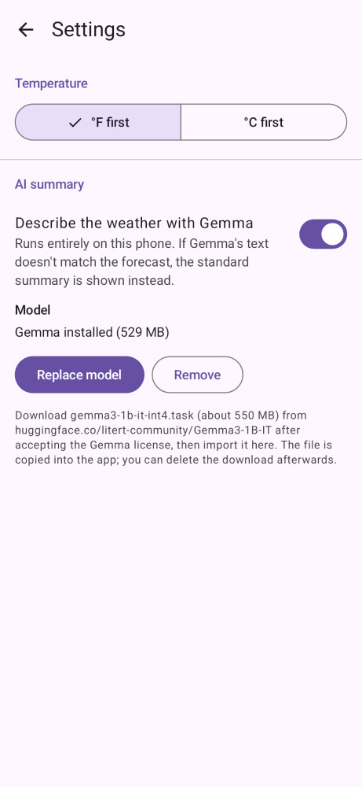

# WeatherApp

A simple Android app that shows the weather for your current location and any places you save, in both °F and °C.

- Search for any city and save it; swipe between places, reorder or remove them
- Current location is optional: turn it off and use saved places only
- A one-line summary at the top, a large temperature in your preferred unit with the other unit alongside, today's high/low and rain chance, and the next 12 hours
- Optional on-device AI summary written by [Gemma](https://ai.google.dev/gemma), run locally with [MediaPipe LLM Inference](https://ai.google.dev/edge/mediapipe/solutions/genai/llm_inference). No data leaves the phone
- Weather and place search from [Open-Meteo](https://open-meteo.com/) (free, no API key)
- Uses Android's built-in location service (no Google Play Services required)
- Kotlin + Jetpack Compose, min Android 8.0 (API 26)

## Screenshots

| Weather | Dark | Gemma summary | Permission |
|:---:|:---:|:---:|:---:|
|  |  |  |  |

| Search | Places | Settings | Error |
|:---:|:---:|:---:|:---:|
|  |  |  |  |

These are rendered from the app's real UI code with sample data using [Paparazzi](https://github.com/cashapp/paparazzi). To regenerate them after UI changes:

```
./gradlew recordPaparazziDebug
```

`./gradlew verifyPaparazziDebug` fails if the UI no longer matches them.

## On-device Gemma summary

The summary line always starts as a built-in template ("71° and partly cloudy now, with a high of 74°…"). If you import a Gemma model, the app also asks Gemma to describe the forecast and shows its text instead, marked "Written by Gemma on this device".

To set it up:

1. On Hugging Face, open [litert-community/Gemma3-1B-IT](https://huggingface.co/litert-community/Gemma3-1B-IT), accept the Gemma license and download `gemma3-1b-it-int4.task` (about 550 MB) to the phone.
2. In the app, go to **Settings → AI summary → Import model** and pick the file. The app copies it into its private storage, so you can delete the download afterwards.

How it works:

- The model runs on the CPU through MediaPipe LLM Inference (`com.google.mediapipe:tasks-genai`), with low temperature and a 30-second timeout. It's loaded on first use and kept in memory while the app runs.
- The prompt is a short instruction plus the forecast as JSON, in your preferred unit ([`GemmaPrompt`](app/src/main/java/com/mazzucci/weather/narration/GemmaPrompt.kt)).
- Gemma's reply is checked before it's shown ([`NarrationValidator`](app/src/main/java/com/mazzucci/weather/narration/NarrationValidator.kt)). Every temperature, percentage and other number must match the forecast data, and the reply must be at most 2 short sentences of plain text. If the check fails, or the model is missing, slow or errors out, the template summary stays.
- Expect a few seconds per summary on recent phones and longer on older ones. MediaPipe's native library makes the APK bigger, so it's built only for 64-bit ARM (phones) and x86_64 (emulators). It needs a 64-bit device.

## Code layout

```
app/src/main/java/com/mazzucci/weather/
  domain/     Place, Forecast, AppSettings; unit conversion and formatting; WMO code descriptions
  data/       HttpClient, Open-Meteo forecast + geocoding API and JSON parsers,
              saved places + settings repositories (SharedPreferences), device location
  narration/  WeatherNarrator: TemplateNarrator, GemmaNarrator (MediaPipe), GemmaPrompt,
              NarrationValidator, ValidatingNarrator, GemmaModelStore (model import)
  ui/         WeatherViewModel (StateFlow), stateless screens, WeatherApp (navigation, pickers)
```

## Build and test

Requires JDK 17 and the Android SDK (`ANDROID_HOME` or `local.properties` pointing at it).

```
./gradlew testDebugUnitTest verifyPaparazziDebug assembleDebug
```

[GitHub Actions](.github/workflows/ci.yml) runs the same command on every pull request and push to `main`, and uploads the test reports and screenshot diffs if a test or screenshot check fails.

The unit tests cover JSON parsing (with real Open-Meteo responses as fixtures), formatting, the template narrator, LLM output validation, the repositories and the ViewModel (with fakes). The APK ends up in `app/build/outputs/apk/debug/`.

## License

[MIT](LICENSE)
