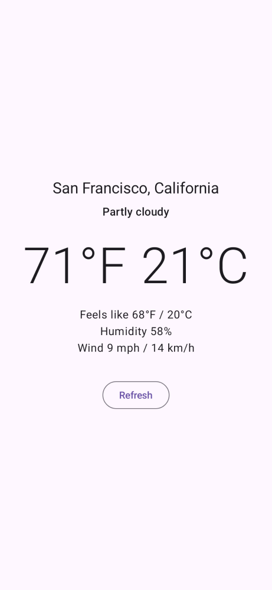
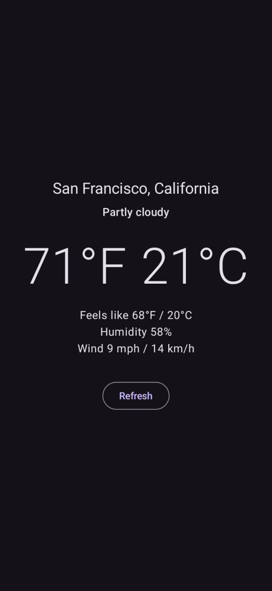
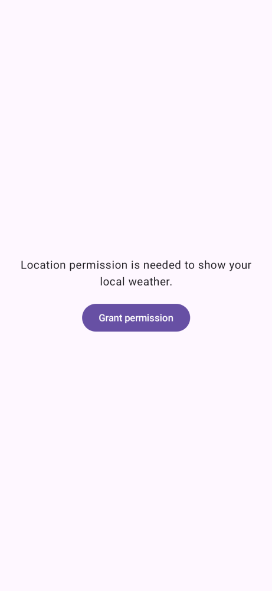
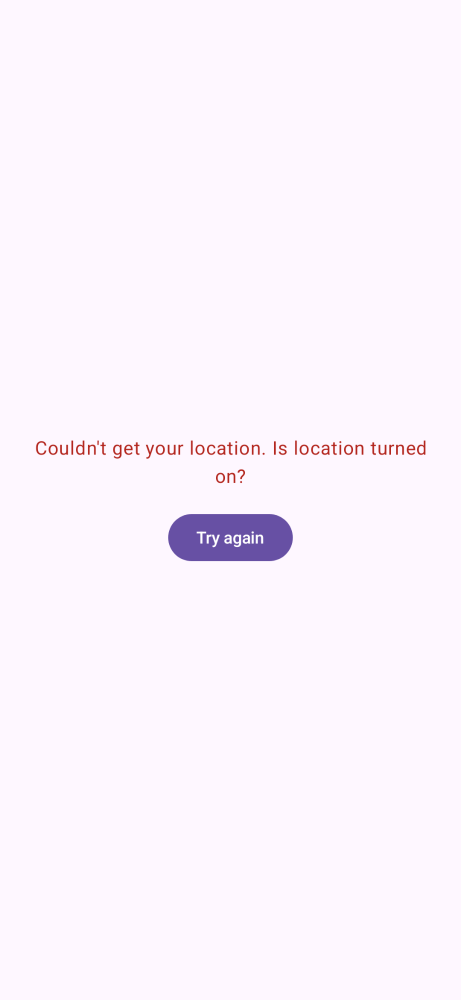

# WeatherApp

A simple Android app that shows the current weather at your location in both °F and °C.

- Temperature, "feels like", humidity, and wind
- Weather data from [Open-Meteo](https://open-meteo.com/) (free, no API key)
- Uses Android's built-in location service (no Google Play Services required)
- Kotlin + Jetpack Compose, min Android 8.0 (API 26)

## Screenshots

| Light | Dark | Permission | Error |
|:---:|:---:|:---:|:---:|
|  |  |  |  |

These are rendered from the app's real UI code with sample data using [Paparazzi](https://github.com/cashapp/paparazzi). To regenerate them after UI changes:

```
./gradlew recordPaparazziDebug
```

`./gradlew verifyPaparazziDebug` fails if the UI no longer matches them.

## Build

Requires JDK 17 and the Android SDK (`ANDROID_HOME` or `local.properties` pointing at it).

```
./gradlew assembleDebug
```

The APK ends up in `app/build/outputs/apk/debug/`.

## License

[MIT](LICENSE)
